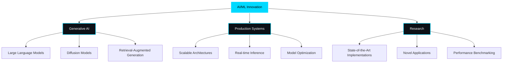

<div align="center">

# Israr Hussain

### Machine Learning Engineer | AI Research & Development | MLOps Specialist

[](https://git.io/typing-svg)

</div>

---

## 👨‍💻 Professional Summary

Machine Learning Engineer with expertise in designing, developing, and deploying scalable AI solutions. Specialized in deep learning architectures, natural language processing, and computer vision systems. Proven track record of translating complex business requirements into innovative machine learning applications with measurable impact.

```python
class ProfessionalProfile:
    def __init__(self):
        self.name = "Israr Hussain"
        self.role = "Machine Learning Engineer"
        self.expertise = ["Deep Learning", "NLP", "Computer Vision", "MLOps"]
        self.focus = "Production ML Systems & AI Innovation"
        
    def core_competencies(self):
        return {
            "machine_learning": {
                "supervised": ["Classification", "Regression", "Ensemble Methods"],
                "unsupervised": ["Clustering", "Dimensionality Reduction"],
                "deep_learning": ["CNNs", "RNNs", "Transformers", "GANs"]
            },
            "mlops": ["Model Deployment", "CI/CD", "Monitoring", "A/B Testing"],
            "cloud_platforms": ["AWS SageMaker", "Google Cloud AI", "Azure ML"]
        }
```

---

## 🎓 Technical Expertise

<div align="center">

### Core Technologies


### Specialization Areas

| Deep Learning | Natural Language Processing | Computer Vision | MLOps |
|:---:|:---:|:---:|:---:|
| Neural Networks | Transformers (BERT, GPT) | Object Detection | Model Deployment |
| Transfer Learning | Text Classification | Image Segmentation | CI/CD Pipelines |
| Model Optimization | Sentiment Analysis | Facial Recognition | Monitoring & Logging |
| Architecture Design | Named Entity Recognition | Image Generation | A/B Testing |

</div>

---

## 📊 GitHub Analytics

<div align="center">


</div>

<div align="center">
  


</div>

---

## 🔬 Research & Development Focus

<div align="center">



</div>

---

## 💼 Professional Capabilities

<div align="center">

| Category | Technologies & Frameworks |
|:---------|:--------------------------|
| **ML Frameworks** | TensorFlow, PyTorch, Keras, Scikit-learn, XGBoost, LightGBM, CatBoost |
| **Deep Learning** | CNNs, RNNs, LSTMs, GRUs, Transformers, GANs, VAEs, Autoencoders |
| **NLP** | BERT, GPT, T5, Word2Vec, GloVe, spaCy, NLTK, Hugging Face Transformers |
| **Computer Vision** | OpenCV, YOLO, ResNet, EfficientNet, Mask R-CNN, Detectron2 |
| **Data Processing** | Pandas, NumPy, Dask, Apache Spark, SQL, NoSQL |
| **Visualization** | Matplotlib, Seaborn, Plotly, TensorBoard, Weights & Biases |
| **MLOps** | MLflow, Kubeflow, Docker, Kubernetes, Jenkins, GitHub Actions |
| **Cloud Platforms** | AWS (SageMaker, EC2, S3), Google Cloud (Vertex AI), Azure ML |
| **Programming** | Python, R, SQL, Bash, Git |

</div>

---

## 📈 Contribution Activity

<div align="center">

[](https://github.com/israrhussainglt)

</div>

---

## 🎯 Current Initiatives

<div align="center">

| Initiative | Focus Area | Technology Stack |
|:-----------|:-----------|:----------------|
| 🤖 **Generative AI** | Fine-tuning LLMs for domain-specific applications | GPT, BERT, LoRA, PEFT |
| 🔍 **MLOps Pipeline** | End-to-end ML system automation | Docker, Kubernetes, MLflow |
| 📊 **Production Systems** | Scalable inference and monitoring | FastAPI, Redis, Prometheus |
| 🧪 **Research** | Implementing cutting-edge papers | PyTorch, TensorFlow |

</div>

---

## 🏆 Professional Achievements

<div align="center">


</div>

---

## 💻 Code Quality Metrics

<div align="center">

| Metric | Value |
|:-------|:------|
| **Primary Language** | Python (85%+) |
| **Code Reviews** | Regular Contributor |
| **Documentation** | Comprehensive |
| **Testing** | Unit & Integration Tests |
| **Best Practices** | PEP 8, Type Hints, Clean Code |

</div>

---

## 🌐 Professional Network

<div align="center">

[](https://linkedin.com/in/israrhussain)
[](https://github.com/israrhussainglt)
[](mailto:your.email@example.com)
[](https://yourportfolio.com)

</div>

---

## 📝 Latest Blog Posts & Articles

<!-- BLOG-POST-LIST:START -->
- Building Scalable ML Pipelines with Kubernetes
- Fine-tuning Large Language Models: Best Practices
- Computer Vision: From Theory to Production
- MLOps: Bridging the Gap Between Development and Deployment
<!-- BLOG-POST-LIST:END -->

---

## 💡 Philosophy & Approach

> "Excellence in machine learning comes not just from understanding algorithms, but from the ability to translate business needs into robust, scalable, and maintainable AI solutions."

<div align="center">

### Core Principles

**Innovation** • **Reliability** • **Scalability** • **Best Practices** • **Continuous Learning**

</div>

---

<div align="center">

### 📊 Profile Statistics


---

**Open to Collaboration** • **Available for Consulting** • **Active Open Source Contributor**

⭐️ *Crafted with precision by [Israr Hussain](https://github.com/israrhussainglt)*

</div>
