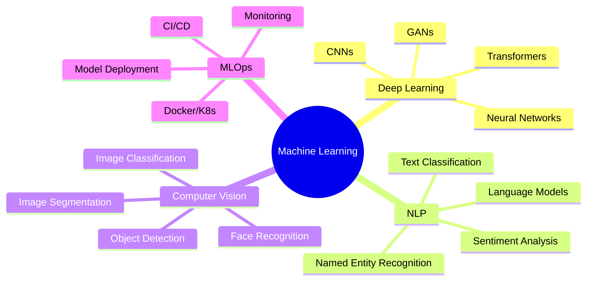

<div align="center">
  
# 👋 Hi, I'm Israr Hussain

### 🤖 Machine Learning Expert | AI Enthusiast | Data Scientist


</div>

---

## 🚀 About Me

```python
class MachineLearningExpert:
    def __init__(self):
        self.name = "Israr Hussain"
        self.username = "israrhussainglt"
        self.role = "ML Engineer & Data Scientist"
        self.location = "Rawalpindi, Pakistan"
        
    def get_specializations(self):
        return {
            "deep_learning": ["Neural Networks", "CNNs", "RNNs", "Transformers"],
            "nlp": ["BERT", "GPT", "Text Classification", "NER"],
            "computer_vision": ["Object Detection", "Image Segmentation", "GANs"],
            "mlops": ["Model Deployment", "CI/CD", "Monitoring"]
        }
    
    def current_focus(self):
        return ["Generative AI", "LLMs", "MLOps", "Production ML Systems"]
```

---

## 🛠️ Tech Stack & Tools

<div align="center">

### Languages & Frameworks


### MLOps & Cloud


</div>

---

## 📊 GitHub Stats

<div align="center">
  


</div>

<div align="center">
  


</div>

---

## 🏆 GitHub Trophies

<div align="center">
  


</div>

---

## 📈 Contribution Graph

<div align="center">
  
[](https://github.com/israrhussainglt)

</div>

---

## 🎯 Current Projects & Focus Areas

<div align="center">

| 🤖 Generative AI | 🧠 Deep Learning | 📊 MLOps | 🔬 Research |
|:---:|:---:|:---:|:---:|
| LLM Fine-tuning | Neural Architecture | Model Deployment | Latest Papers |
| Prompt Engineering | Computer Vision | CI/CD Pipelines | Innovation |
| RAG Systems | NLP Models | Monitoring | Best Practices |

</div>

---

## 💻 Most Used Languages

<div align="center">

<!--START_SECTION:waka-->
```text
Python       ████████████████████░░░   85.0%
Jupyter      ███░░░░░░░░░░░░░░░░░░░   08.5%
SQL          ██░░░░░░░░░░░░░░░░░░░░   04.0%
Other        █░░░░░░░░░░░░░░░░░░░░░   02.5%
```
<!--END_SECTION:waka-->

</div>

---

## 🌟 Featured Skills

<div align="center">



</div>

---

## 📫 Connect With Me

<div align="center">

[](https://github.com/israrhussainglt)
[](https://linkedin.com/in/israrhussain)
[](https://twitter.com/israrhussain)
[](mailto:your.email@example.com)

</div>

---

## 💡 Quote of the Day

<div align="center">


</div>

---

## 🐍 Contribution Snake

<div align="center">


</div>

---

<div align="center">

### 🔥 "The best way to predict the future is to invent it" - Alan Kay


⭐️ From [israrhussainglt](https://github.com/israrhussainglt)

</div>
